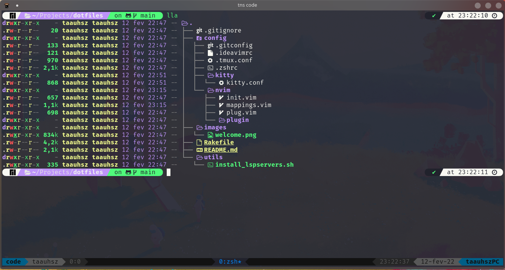

# Warning

**Don't use my configs if you don't know what it does!** Use at your own risk.

## Contains

- neovim setup
- zsh config
  -  ohmyzsh
  -  zinit (history-search, auto-suggestions, fast-syntax-highlighting, fzf, powerlevel10k)
- gitconfig
- tmux config

## Neovim setup

- Native LSP
  -  [nvimlsp](https://github.com/neovim/nvim-lspconfig)
  -  [nvimcmp](https://github.com/hrsh7th/nvim-cmp)
  -  [lspsaga](https://github.com/glepnir/lspsaga.nvim)
- Themming with top tabs, dev icons and material theme
  -  [Top bar: barbar](https://github.com/romgrk/barbar.nvim)
  -  [Devicons: neovim web devicons](https://github.com/kyazdani42/nvim-web-devicons)
  -  [Material theme](https://github.com/marko-cerovac/material.nvim)
- File explorer
  -  [nvim tree](https://github.com/kyazdani42/nvim-tree.lua)
- Plugin manager
  -  [packer.nvim](https://github.com/wbthomason/packer.nvim)
- All configuration files in Lua

## Prerequisites

### Dependencies

- Ruby
- Rake Gem: gem install rake
- Node
- Last [neovim](https://github.com/neovim/neovim) version

| OS | Command |
| -- | ------- |
| Arch Linux or based distros: | sudo pacman -S base-devel curl zsh lua tmux exa fzf ripgrep ccls |
| Ubuntu or based distros: | sudo apt install build-essential curl zsh lua5.3 tmux exa fzf ripgrep ccls |

## Installation

> Don't forget to install [Ruby](https://github.com/asdf-vm/asdf-ruby) and [NodeJS](https://github.com/asdf-vm/asdf-nodejs) before install
>
> If you want to install my neovim configs, make sure you have the last version of neovim. I recommend you to [build from source](https://github.com/neovim/neovim/wiki/Building-Neovim)
>
> If you want to install some lsps, run the script inside the dotfiles/utils folder
>
> These dotfiles use [powerlevel10k](https://github.com/romkatv/powerlevel10k) theme, make sure you have some [nerd fonts](https://github.com/ryanoasis/nerd-fonts) installed
>
> If the zinit installation is stuck at ***INFO: Updating $HOME/.zshrc(10 lines of code, at the bottom)*** just type enter
>
> Open Neovim, runs: :PackerSync to install all Plugins, restart and runs: :TSInstall all to install Treesitter highlighting.

- Clone the repo
- Inside the repo folder, run -> rake install

All installation files will be backed up if exists.
